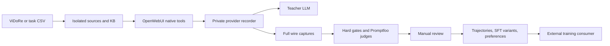

# Multi-turn OpenWebUI datasets

This package preserves the Strategy A data mechanisms without importing its GPU
controllers. It supports a markdown ViDoRe derivative and source-backed task CSVs
from this repository, including BigSurvey. Python **3.11+** is required for the
recorder. Install the optional CPU requirements in an isolated environment:

```bash
python -m pip install -r scripts/promptfoo_openwebui_eval/posttrain/requirements.txt
python -m pip install -r scripts/promptfoo_openwebui_eval/posttrain/requirements-native-test.txt
```

Commands below run from the repository root. `R` is a private experiment directory
outside Git; `E` is a private copy of [.env.example](.env.example). Populate it
with the authorized endpoints, credentials, inventory-resolved model IDs and
positive price ceilings. Neither credentials nor real datasets belong in Git.

```bash
sa() { python -m scripts.promptfoo_openwebui_eval.posttrain --env-file "$E" "$@"; }
sa preflight
sa budget-init --path "$R/api.sqlite" --usd 4 --tokens 8000000 --calls 800 --execute
```

Use the existing ledger when resuming; initialization refuses to reset it. The
numbers above are example **initial limits**, not permission to replace a ledger.
Set `SA_API_BUDGET_DB` to that file. All mutating CLI commands require `--execute`.
No production bridge, model, Valve or connection is reconfigured automatically.

## Files and flow

| File | Responsibility |
|---|---|
| `recorder.py` | Private OpenAI-compatible provider proxy; full requests/responses, SSE tools/reasoning/usage, single worker and cumulative budget accounting |
| `native_bridge.py` | Dedicated instance of the historical bridge/client with native Socket.IO completion and durable task reconciliation |
| `integration.py`, `split_retrieval.py` | Reuse the original generator; isolate test KBs/tools/models, collect and optionally branch from terminal states |
| `vidore.py`, `datasets.py` | Pinned ViDoRe snapshots, task CSV adapter, reviewed catalog and portable dataset exports |
| `evaluation.py`, `promptfoo_assert.py` | Hard gates, independent correctness/grounding judges, Promptfoo import receipts and paired evaluation |
| `core.py` | Capture validation, tool schemas, reasoning variants, cumulative measures and same-state preferences |
| `inference_limits.py`, `budget.py`, `.env.example` | Explicit per-call/episode limits and durable API reservations |
| `__main__.py` | Data CLI; no Axolotl, RunPod, PPO or GPU allocation commands |



The recorder sits **between OpenWebUI and its LLM provider**, after OpenWebUI has
added the system prompt, tool schemas and observations. It preserves every model
request and response. The abbreviated `/generate` bridge trace is not used to
reconstruct training examples. Model output stored in wire captures is authoritative;
the presentation answer returned by OpenWebUI is retained separately.

## Prepare ViDoRe or existing task CSVs

```bash
sa vidore --snapshot "$R/reviewed-snapshots.json" --output "$R/vidore" --execute
# Alternatively: --download --revisions "$R/hf-revisions.json" with explicit HF SHAs.
```

ViDoRe uses five corpora, 50 original QA, document-group splits 30/10/10 and 25
FR/25 EN. Coverage failures stop construction rather than inventing references.
All pages of selected documents are retained. Inspect licenses, markdown fidelity,
tables and evidence; this is not the official visual benchmark. Explicit reviewed
`--exclusions` and `--split-plan` preserve a previously frozen split.

For BigSurvey or another source-backed task, reuse its existing CSV schema:

```bash
sa import-csv --csv scripts/promptfoo_openwebui_eval/datasets/bigsurvey/step2_input.csv \
  --source-root "$PWD" --assignments "$R/splits.json" --output "$R/tasks" --execute
```

`splits.json` maps every `dataset:task_id` in the selected CSV to an explicit
`{"split":"train","group_id":"source-group","language":"en"}` assignment.
Repeated/shared sources must stay in the same split. Select one task row per ID;
parameter variants and translations are not independent questions.

The adapter retains `request_prompt` (or `query`), the original `gold_summary`,
source files and original task metadata. References stay in the evaluation cases,
never the uploaded documents or generation payload. Content hashes prevent source
leakage across splits. An added stable source marker allows evidence tracing;
the rest of each source is preserved. For generic tasks the retrieval gate checks
one declared source, **not an official qrel annotation**.

Reviewed per-task `tool_parameters_json`, summarizer ID, algorithm, target length,
structure, top-p and extra instructions are passed through to the existing
generator. Endpoint/model/tool bindings and token budgets come from the experiment
specification. Empty-source/open-retrieval CSVs require another explicit adapter.

## Configure an isolated live collector

Start each service with **one worker**, private storage and the same private env:

```bash
python -m uvicorn scripts.promptfoo_openwebui_eval.posttrain.recorder:app_factory \
  --factory --host 127.0.0.1 --port 8013 --workers 1 --env-file "$E"
python -m uvicorn scripts.promptfoo_openwebui_eval.posttrain.native_bridge:app_factory \
  --factory --host 127.0.0.1 --port 8015 --workers 1 --env-file "$E"
```

In the dedicated OpenWebUI instance, add a private provider connection to the
recorder's reachable `/v1` address, with `SA_PROXY_TOKEN`. For a containerized
OpenWebUI, localhost inside the container is not the host: use a private network
route and bind the recorder appropriately, never expose it publicly. Set
`SA_NATIVE_INSTANCE_REVIEWED=true` only after reviewing that test instance;
`SA_NATIVE_BASE_URL` must equal `OPENWEBUI_BASE_URL`. Use different strong proxy
and admin tokens. Disable title/tag/follow-up tasks and exclude other user traffic.

Review and fill [examples/provision.json](examples/provision.json); `provision`
creates only new `sa-*` resources. For the isolated built-in search/source-reader,
use `retrieval_mode: "split_bound"` and a reviewed test blueprint, following the
explicit rights/tool/isolation flags. Existing production resources are never
overwritten. Provisioning uploads complete selected source paths, not oracle pages.

```bash
sa provision --dataset "$R/vidore" --spec "$R/provision.json" \
  --output "$R/resources.json" --execute
sa collect --dataset "$R/vidore" --resources "$R/resources.json" \
  --spec "$R/collect.json" --run "$R/train-001" --execute
sa score --run "$R/train-001" --execute
```

Start with one train case and candidate. The collect example uses the native
bridge state barrier: an ambiguous or still-active remote task blocks further
collection and retains the recorder session. Never blindly retry a charged POST.
`score` invokes the installed Promptfoo CLI and imports the resulting grades.
Judge infrastructure failures are not semantic negatives. Correctness sees the
reference; grounding sees only the tool observations actually received in the
final provider request. A source marker alone does not establish grounding.

Limits are defined in `.env.example`: explicit spec values override environment
defaults. UTF-8 input bounds are conservative bytes, not measured tokens; output
limits include thinking. Cumulative calls/tools/output/time differ from per-call
limits. No silent truncation or automatic budget increase occurs.

This collector currently uses **agentic KB search**. Automatic attachment RAG and
whole-document context remain separate modes to validate. A summarization tool
that itself calls another LLM endpoint is not covered by the top-level recorder:
instrument and budget those calls before claiming full trajectories or costs.
Do not treat an opaque tool result as the internal model's training history.

## Review and build

Read the evidence and verdict before writing `reviews.jsonl`. Each complete
episode needs `benchmark_id`, boolean `accepted`, nonempty `finding`, and
`grades_sha256` matching the bytes of its run's `grades.jsonl`. A reviewer may
veto an automatic pass but cannot promote an automatic failure.

```bash
sa catalog --runs "$R/train-001" --reviews "$R/reviews.jsonl" \
  --output "$R/episodes.jsonl" --execute
sa build --dataset "$R/vidore" --runs "$R/train-001" \
  --reviewed-catalog "$R/episodes.jsonl" --output "$R/data-001" \
  --with-reasoning --execute
```

Supply all complete input runs in `--runs`. Incomplete/technical attempts remain
in the original archive and never become negative training targets. The existing
[reviewed selection exporter](../REVIEWED_EPISODES.md) also accepts a campaign
catalog containing explicitly classified technical incidents. No original run
is deleted when a question without an accepted answer is excluded from training.

| Output | Training/evaluation meaning |
|---|---|
| `sft.jsonl` | Next-action examples from accepted episodes; only the last assistant action is supervised; assistant thinking removed from context and target |
| `sft-reasoning.jsonl` | Same selected actions with captured textual thinking in assistant context/targets; missing thinking is reported, never fabricated |
| `trajectories.jsonl` | Full wire captures of successes and semantic failures, original usage, scores, review and protocol |
| `episodes.jsonl`, `questions.jsonl` | Selected reviewed metadata and original TRAIN cases; every retained question has a solution |
| `pairs.jsonl` | Chosen/rejected terminal answers with exactly matching prompt, tools and observations; may legitimately be empty |
| `task-results.csv` | For imported tasks, original CSV variables plus answers and cumulative usage, reusable by existing task-specific DEA assertions |
| `build.json`, `reasoning-build.json` | Selection/hash receipts, counts, missing reasoning and pending trainer validation |

Tool observations stay intact in both SFT variants. SFT normalizes tool-call IDs
and JSON schema/argument serialization; raw requests remain in `trajectories.jsonl`.
Tool schemas and system/developer messages are retained. The external trainer must
still verify its actual tokenizer, template, labels, sequence lengths and masks.

For BigSurvey, retain the existing DEA evaluation (`bigsurvey.step2.dea.yaml`) in
addition to QA/grounding. Collection writes the original task variables and measured
usage to the run's `candidates.csv`, ready for DEA **before manual review**. Use it
as the tests input in a private copy of the existing config. The later
`task-results.csv` also supports replay. Review those task-specific scores before
accepting a training episode; generic QA gates do not measure document structure
or bibliography quality. Existing judge-enabled DEA configs may make paid calls.

Cumulative metrics sum every captured request: input/output/total tokens, calls,
tool calls and elapsed seconds. Cache/reasoning tokens are subsets, not extra
tokens. Missing counters stay unknown. Selection after retries is not pass@1;
compare models on a fixed held-out protocol, keeping test sealed.

Preference files can support a separately validated DPO/SimPO consumer. These
captures are **not PPO-ready**: there is no collection of behavior-policy token
log-probabilities/values or on-policy update loop. No PPO trainer is included.

## Verification

```bash
python -m pytest tests/test_promptfoo_openwebui_bundle.py tests/test_reviewed_episodes.py \
  tests/test_strategy_a_*.py -q
```

Tests exercise the actual HTTP/Socket.IO adapters with simulated providers and
the complete build path, including failure conditions. Separately replay real
captures and compare SFT output hashes. Neither proves that an untested new live
model/tool configuration works: complete a bounded live pilot before scaling it.
The five original upstream file hashes are checked by `preflight`; review drift
rather than bypassing it. No production code is patched in place.

## Fixed-protocol comparison report

Compare private, unselected dev runs offline (no provider/judge calls):

```bash
python -m scripts.promptfoo_openwebui_eval.posttrain compare \
  --baseline "$EXPERIMENT_DIR/base-dev" --candidate "$EXPERIMENT_DIR/adapter-dev" \
  --output "$EXPERIMENT_DIR/comparison.json" --execute
```

The JSON report retains the original gain/regression/budget decision and adds
pass@1 counts/rates, every retrieval/grounding/hard gate, semantic/hard/technical
and budget-incomplete failure rates, paired per-question outcomes, observed
cumulative provider usage/cost, timings, and 95% intervals for rates and the paired
pass@1 difference. A deterministic percentile bootstrap resamples source groups
(dataset + group_id), keeping translations/paraphrases together (2,000 draws,
seed 0). One source group yields `null` intervals. Small/homogeneous samples can
produce degenerate intervals; these are pilot summaries, not proof of improvement.

All scheduled cases must have exactly one completed episode or reconciled failure.
Case/reference content, split, repeats, retrieval/reasoning/budget/deployment
configuration, judge identity/rubric/limits/prices, export/grade/capture receipts,
and frozen Promptfoo configuration are checked. Protocol and input receipt hashes
are included for audit. Train, branches, best-of-N, missing cases, changed exports,
and configuration drift are refused. Test comparison requires explicit
`--unseal-test`; the default does not read its case/reference/capture files. Use dev
for selection and freeze the protocol before explicitly opening test.

`observed_provider_usage` sums all recorded top-level calls, including repeated
inputs. Cache/reasoning counts are subsets. Missing counters/cost/timing remain
`null`; a measured zero cost remains zero. Hidden tool calls, their cost and whole
episode totals remain `null` because this recorder cannot observe other endpoints.
No cost is inferred from tokens or price ceilings. Judge charges and storage/index
costs are outside generation cost. Unknown output usage stops efficiency decisions.

Interrupted collection/judge runs must be reconciled privately before reporting;
a partial run is refused. The offline comparison accepts a `failures.jsonl`
sidecar with one row per scheduled unsuccessful case:

```json
{"case_id":"q2","status":"TECHNICAL_FAILURE","reason":"Transport timeout"}
```

`BUDGET_INCOMPLETE` is the other allowed status. Bind the complete failure list
with `COMPLETE.json.failures_hash = digest(failures)` using the canonical core
hash function; keep completed candidates and their grading receipts unchanged.
This is an explicit operator reconciliation contract, not automatic incident
classification or retry authorization. Every case must occur exactly once across
candidates and failures. Failed cases count in pass@1 and failure denominators;
their unmeasured gates/scores and usage stay unknown, never semantic negatives.
Gate rates mean measured passes divided by all scheduled cases and include an
`unknown_count`. Reconciled candidate incidents stop the existing promotion gate.
